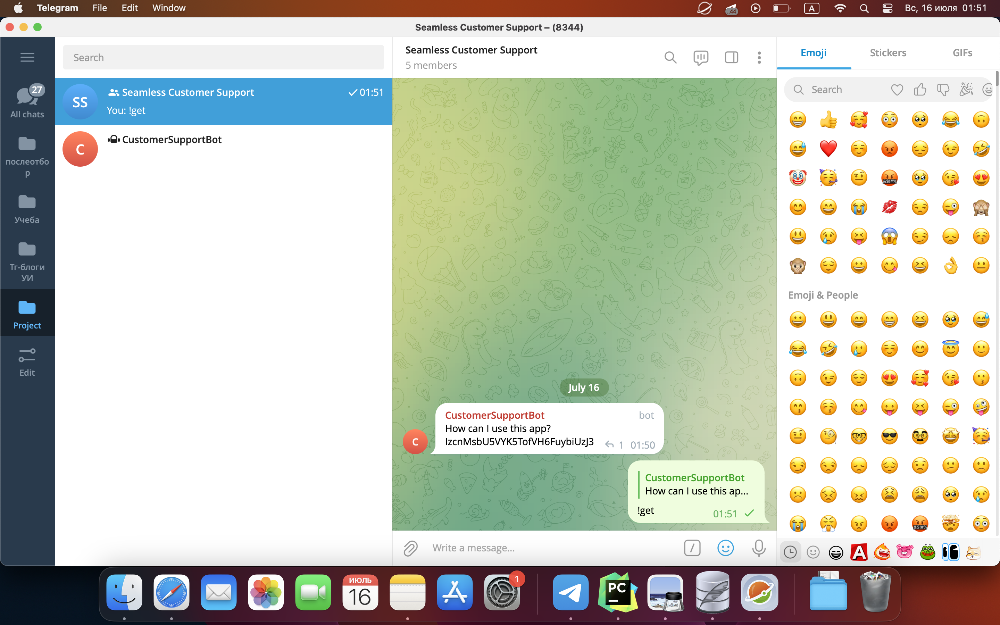

# Seamless Customer Support

Welcome to our Seamless Customer Support project! Our main objective is to provide a convenient and efficient platform for both volunteers and users to enhance their customer support experience. 

## Features

Our service offers the following features:

1. **Web-Based Chat**: Users can easily ask their questions through our user-friendly web page chat interface. This provides a seamless experience for users to seek assistance.

2. **Telegram Integration**: Volunteers are organized into a dedicated group on Telegram. Our bot automatically sends new questions to this group, ensuring that volunteers stay up to date with incoming inquiries.

3. **Efficient Question Handling**: Volunteers can access and respond to questions directly from the Telegram group. This streamlined process enables quick and effective communication between volunteers and users.

4. **Suggested Answers**: To expedite response times, our service suggests similar answers to questions that have been asked previously. This feature allows volunteers to provide prompt and accurate responses based on existing knowledge.

5. **Easy Integration**: Our customer support service can be easily integrated into both mobile and web applications. This flexibility allows businesses and organizations to incorporate our solution seamlessly into their existing platforms.

## Demo





## How to use

To use our Customer Support Service, follow these steps:

1. **User Side:**
   - Access the web page where the chat interface is provided.
   - Type your question or inquiry in the chat input field.
   - Hit the enter key or click the send button to submit your question.
   - Wait for a response from a volunteer.

2. **Volunteer Side:**
   - Join the designated Telegram group for volunteers.
   - Receive new questions automatically from the bot in the Telegram group.
   - Read the questions and decide which one to answer.
   - Type your response in the Telegram group chat and send it.
   - Repeat the process for new questions as they arrive.


## Getting Started

To get started with our Customer Support Service, follow these steps:

1. Clone the repository and navigate to the project directory.

2. Customize the chat interface and integrate it into your web and mobile apps as per the provided documentation.

3. Configure the Telegram bot to send new questions to your designated volunteer group.

4. Deploy the service on your preferred hosting platform or server.

5. Make all steps of installation from the instruction below.

6. Test the integration thoroughly to ensure a smooth user experience.

### Deployment instructions
Perform all this actions to run service.


#### FAQ

Go to folder FAQ and run this commands in your terminal.
```shell
pip install firebase-admin
pip install sentence-transformers
pip install pytelegramapi

python3 FAQ.py
```

#### Bot

Go to folder Bot and run this commands in your terminal.
```shell
pip install firebase-admin
pip install sentence-transformers
pip install sqlite3

python3 main.py
```

#### Frontend

Go to folder Frontend and run commands in your terminal.
```shell
npm install
npm run dev
```

## Frameworks or Technologies Used

The following frameworks and technologies are used in this project:

- React.js
- Vite.js
- Telegram API
- HTML/CSS
- JavaScript
- FireStore

## Contribution Guidelines

We welcome contributions from the community to help us improve and expand our Customer Support Service. If you would like to contribute, please follow these guidelines:

1. Fork the repository and create a new branch for your contribution.

2. Make your changes, addressing any open issues or introducing new features.

3. Ensure that your code adheres to our coding standards and best practices.

4. Test your changes thoroughly to avoid introducing any bugs or regressions.

5. Submit a pull request, describing the changes you have made and any relevant information.

We appreciate your support in making our Customer Support Service even better!

## Badges

[](https://gitlab.pg.innopolis.university/m.gladyshev/seamlesscustomersupport/)

## License

This project is licensed under the [MIT License](LICENSE). Feel free to modify and distribute it according to your needs.

## Contact

If you have any questions, suggestions, or feedback regarding our Customer Support Service, please reach out to us at [m.gladyshev@innopolis.university](mailto:m.gladyshev@innopolis.unversity). We appreciate your input!
